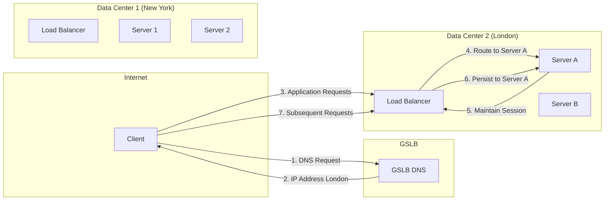

```mermaid
graph LR
    subgraph Internet
        C[Client]
    end

    subgraph GSLB
        DNS[GSLB DNS]
    end

    subgraph "Data Center 1 (New York)"
        LB1[Load Balancer]
        S1[Server 1]
        S2[Server 2]
    end

    subgraph "Data Center 2 (London)"
        LB2[Load Balancer]
        SA[Server A]
        SB[Server B]
    end

 C -->|1. DNS Request| DNS
 DNS -->|2. IP Address London| C
C -->|3. Application Requests| LB2
 LB2 -->|4. Route to Server A| SA
    SA -->|5. Maintain Session| LB2
    LB2 -->|6. Persist to Server A| SA
    C -->|7. Subsequent Requests| LB2
```